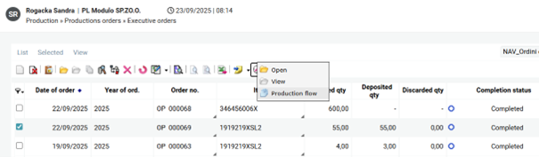
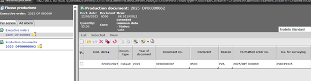
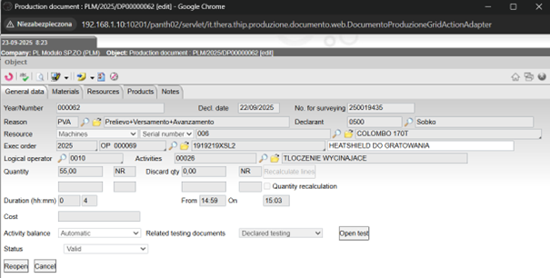
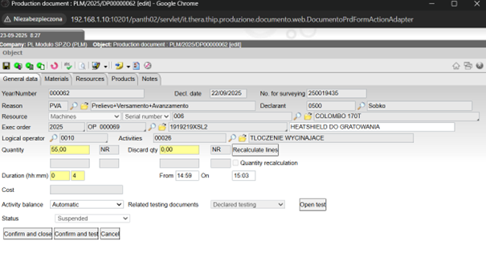
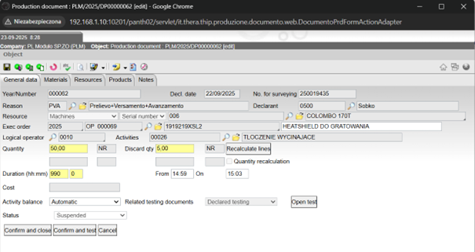
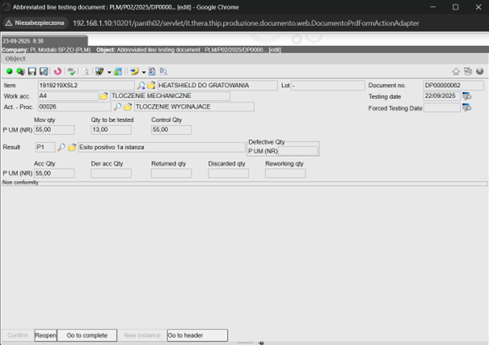
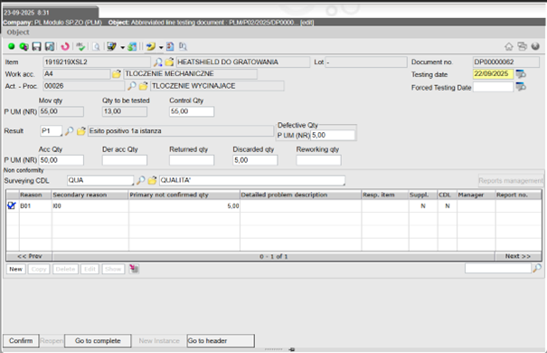
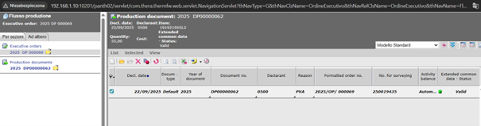
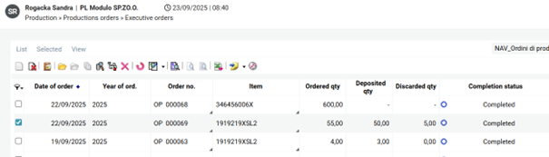

# 🏭 PRODUKCJA –MODYFIKACJA DOKUMENTU PRODUKCYJNEGO
(Zmiana ilości detali dobrych / nieprawidłowych)

## 1️⃣ Przejście do menu zleceń produkcyjnych
`Production >> Production orders >> Executive orders`

## 2️⃣ Otworzenie dokumentu produkcyjnego
`Production >> Production orders >> Executive orders`
Zaznacz zlecenie produkcyjne, które chcesz zmodyfikować.
`W górnym menu wybierz: Navigate >> Production flow.`

### Screenshot

## 3️⃣ Edycja dokumentu
W nowym oknie Production flow kliknij dwukrotnie dokument, który chcesz edytować.

### Screenshot

W oknie Production document wybierz Reopen, aby odblokować możliwość edycji.

### Screenshot

## 4️⃣ Wprowadzenie zmian

Wprowadź korekty w ilości detali prawidłowych / nieprawidłowych.

### Screenshot

### Screenshot

Kliknij: Recalculate lines → Confirm and test.

## 5️⃣ Edycja dokumentu testowego
Otworzy się Abbreviated line testing document.
Kliknij Reopen, aby edytować.

### Screenshot

Ponownie wprowadź zmiany w ilości detali prawidłowych / nieprawidłowych.
Sprawdź, czy podano poprawne: Result, Reason oraz Secondary reason.
Zapisz zmiany przyciskiem Confirm.

### Screenshot

## 6️⃣ Zatwierdzenie zmian
System poinformuje, że dokument testowy był już wygenerowany – potwierdź klikając OK.
Po zapisaniu zmian dokumentu testowego system przeniesie Cię z powrotem do dokumentu produkcyjnego.
Zamknij okno, aby zapisać zmiany.

### Screenshot

## 7️⃣ Finalizacja
System powróci do okna Production flow.
Dokument oznaczony pogrubioną czcionką wskazuje, że został zmodyfikowany.
Zmiana jest również widoczna w głównym menu.

### Screenshot

### Screenshot

