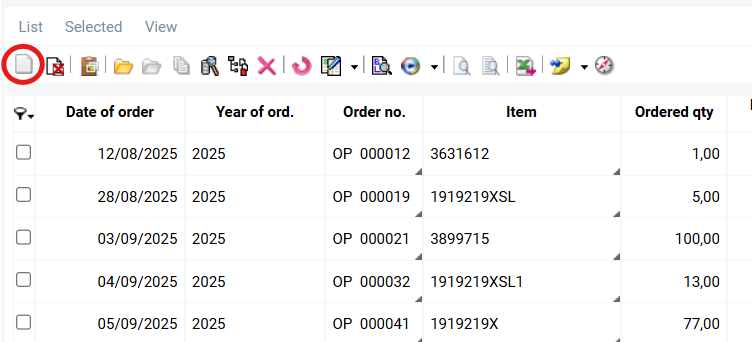
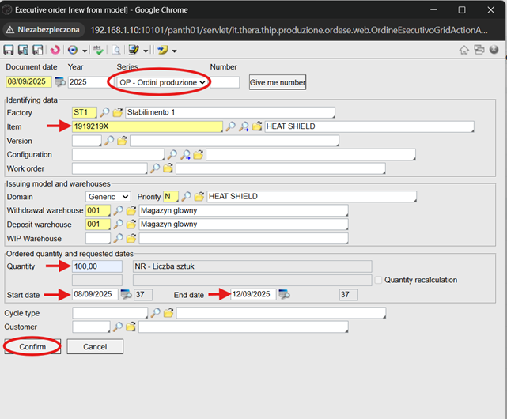
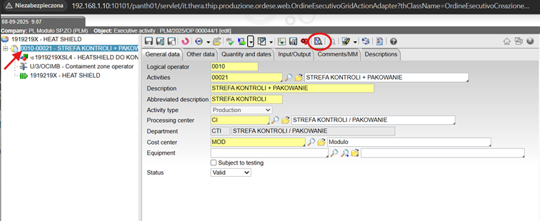
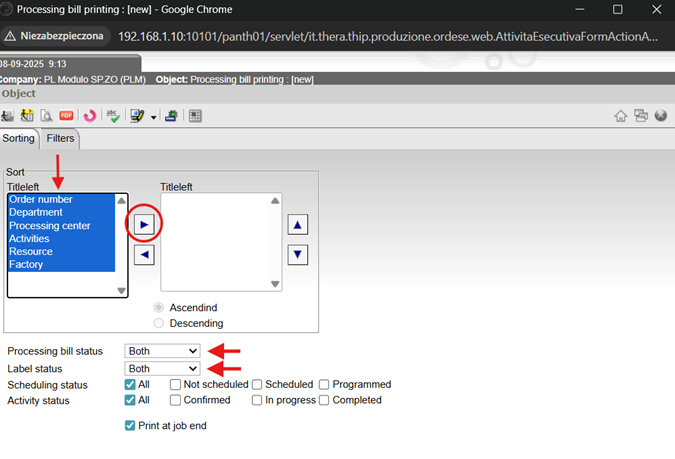
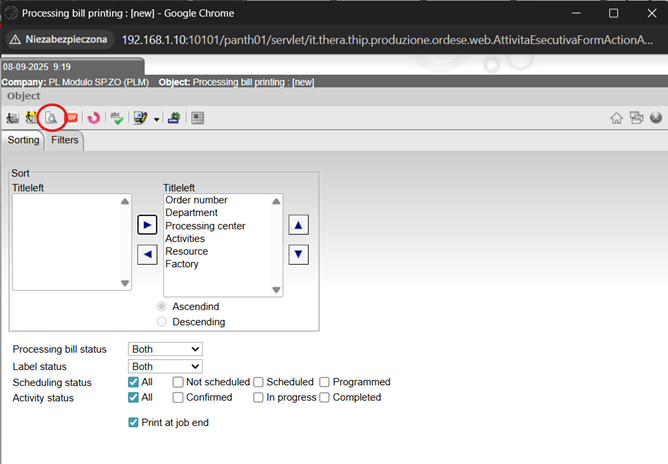
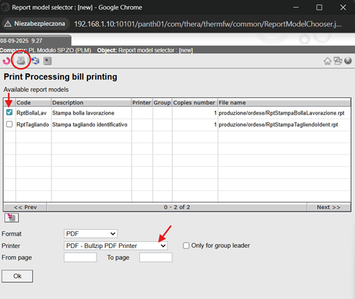
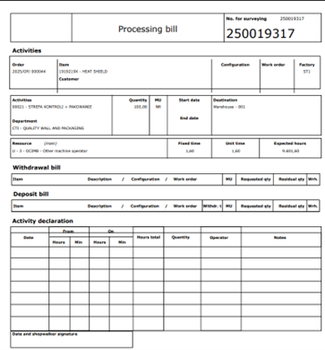
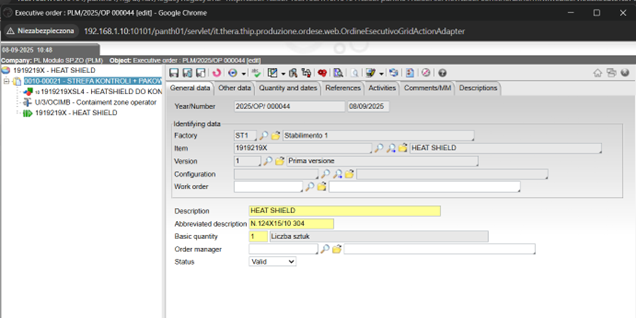
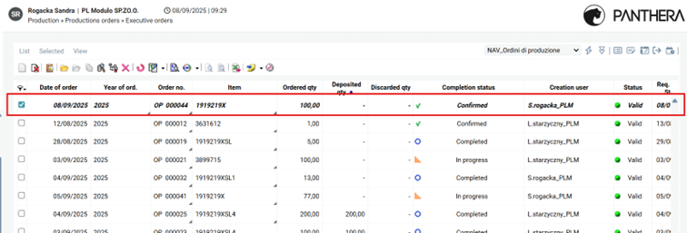

# 🏭 PRODUKCJA – URUCHOMIENIE ZLECEŃ PRODUKCYJNYCH

---

## 1️⃣ Przejście do menu zleceń produkcyjnych
Menu: **Production → Production orders → Executive orders**

### Screenshot

---

## 2️⃣ Tworzenie nowego zlecenia

1. 🖱️ Kliknij **New object**, aby dodać nowe zlecenie.  

### Screenshot

2. W oknie **Executive order [new from model]** uzupełnij pola: **series, item, quantity, start/end date**.

### Screenshot

| Pole | Co wpisać | Uwagi |
|------|-----------|-------|
| **Series** | OP – Ordini produzione | Zlecenie produkcyjne |
| **Item** | numer detalu | np. 12345 |
| **Quantity** | ilość sztuk | np. 100 |
| **Start date** | planowany start | np. 08/09/2025 |
| **End date** | planowany koniec | np. 12/09/2025 |

3. 🖱️ Kliknij **Confirm**, aby zatwierdzić.

---

## 3️⃣ Wydruk karty zlecenia

1. Po zatwierdzeniu nowego zlecenia pojawia się okno z modelem produkcyjnym wybranego detalu.  

### Screenshot

2. Dwukrotnie kliknij na aktywność po lewej stronie (np. strefa kontroli + pakowanie).  

3. 🖱️ Kliknij **Print processing bill** w górnym menu okna.  

4. W oknie **Processing bill printing [new]**:  
   - Zaznacz elementy do wydruku  
   - Przenieś je strzałką z lewej strony (**Titleleft**) na prawą  
   - Ustaw:  
     - **Processing bill status → Both**  
     - **Labels status → Both**  

### Screenshot

5. 🖱️ Kliknij **Print preview**, aby sprawdzić wydruk.  

### Screenshot

6. Wybierz dodatkowe opcje wydruku i rodzaj drukarki.  

### Screenshot

7. 🖱️ Kliknij **Ok**, aby zatwierdzić wydruk.  

### Screenshoty
  

---

## 4️⃣ Zapis zlecenia produkcyjnego

- 🖱️ Kliknij **Save and close**, aby zapisać zlecenie.

  

- Zlecenie pojawi się w tabeli **Executive orders**  

### Screenshot
  

---

## 5️⃣ Statusy zleceń (Completion status)

| Status | Znaczenie |
|--------|-----------|
| **Confirmed** | Zlecenie prawidłowo wypełnione / zatwierdzone |
| **In progress** | Zlecenie rozpoczęte |
| **Completed** | Zlecenie zakończone |

---
